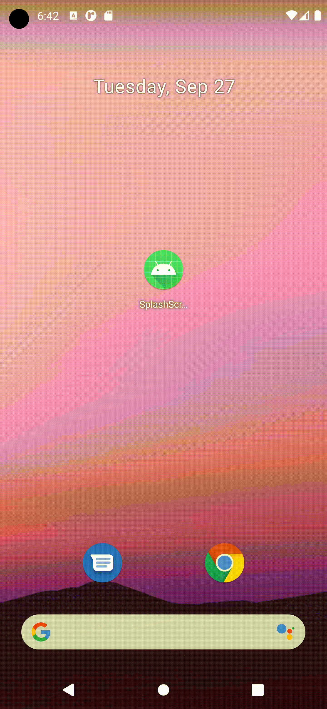
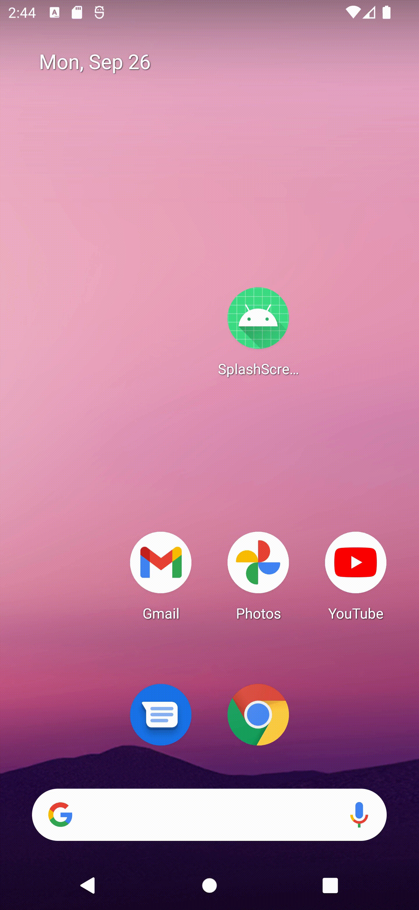

# SplashScreen for Android Apps

Android 12 adds the SplashScreen API, which enables a new app launch animation for all apps. This includes an into-app motion at launch, a splash screen showing your app icon, and a transition to your app itself.

# 🔖　Reference site
* [Android 12 New Splash Screen API](https://developer.android.com/about/versions/12/features/splash-screen)

 
 

# 🔖　ScreenShot

    
    
    

 

    
    
    

 
